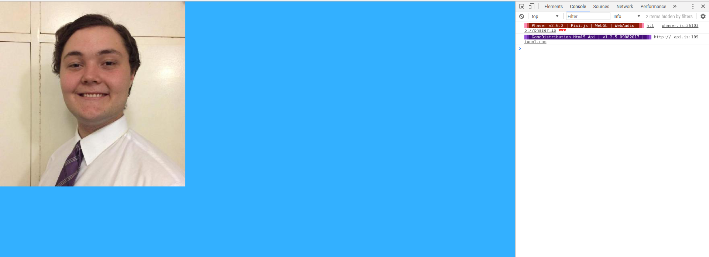
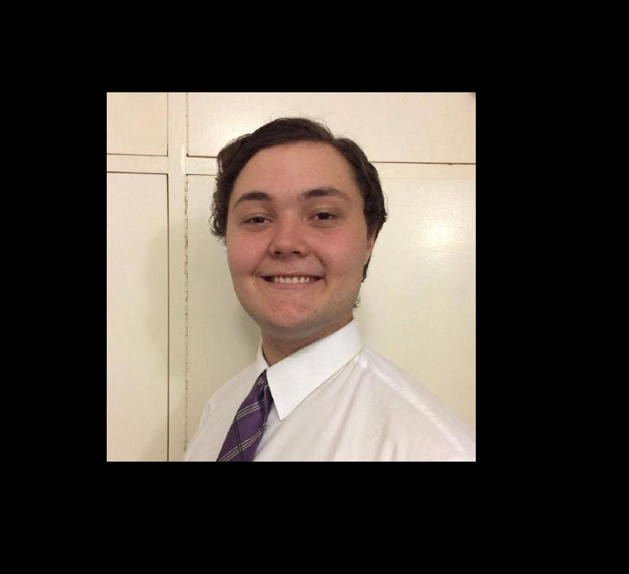

It turns out that a really good way to procrastinate from starting a programming project is to write 2000 words about what the project is and how you're going to build it.

Ever since I started running into issues with zooming in Project Mind Map, it's been a struggle to write code for it. I knew what I **had** to do was restart and do it properly, but part of me just really wanted to solve it how it was.

Now that I've restarted though, the prospect of rewriting code has me procrastinating. Writing blog posts, window-shopping for boilerplates, reading how to do obscure things in TypeScript that have no bearing on this project.

There's a fantastic blog post on Wait But Why called [The Procrastination Matrix](https://waitbutwhy.com/2015/03/procrastination-matrix.html), and it sums up what I'm doing better than I ever could. If you ever struggle with procrastination it's a must-read.

Now that I've identified what I'm doing, let's get to it.

# Boilerplates

A boilerplate is basically a great steel mold used to build boilers. It's also used as a generic term for any template. Phaser has a handful of really great boilerplates just to get you started more easily. Last time I was using [this](https://github.com/djfdat/phaser-typescript-vscode-boilerplate) one, because it's super lightweight. This time I'm using [Orange Game's boilerplate](https://github.com/orange-games/phaser-ts-boilerplate), for a few simple reasons:

Firstly, it's more focused on building something that can be released to the public. It has existing code for ads, for analytics. My last boiler plate was just "Here's a folder containing Phaser. Have at it."

Second, it supports somme of the tools I'm already using. Namely grunt.

Bam, buzzword. Grunt is a little commandline (so entirely text based) tool to help you do things in projects. Type "grunt start" and it runs the "start" command, however you define that. 

This boilerplate has two commands: grunt dev and grunt dist.

Grunt dev builds my code, and then it serves into the url `localhost:8080`. It also watches the code, meaning that any changes I make to my source files will automatically be built. It's neato.

Grunt dist is for when I finally want to release it, it's going to streamline some of the code, get it ready to go into the world.

The third (and honestly my favourite) thing that the Orange Games boilerplate does is enforces a style guide.

There's a lot of different ways to write code, and a style guide is a way to use some consistent rules when writing code. It means that when you use it again later, it's just way easier to parse.

~~~
if(variable<3||3==variable){variable++};
~~~

vs

~~~
if (variable < 3 || variable == 3) {
    variable++;
}
~~

Variable names, spacing, type definitions. It's 10x easier to read code that uses consistent styling, and if my code isn't completely in-line with the style guide, it won't even build. It yells at me - look.

The downside of changing boilerplate is that the new one has a really specific, more complex way of doing some things.

It took me longer than I care to admit to get a picture of my face onto the screen.

*But check it out*

Sometimes it's better to focus on the result of something rather than the work it took, and I think that this is one of those times.

# Maths

Right now, I'm very much of the belief that the primary issue with the old Project Mind Map was the camera. With that in mind, I would *really* like to put together a rock solid camera.

I talk about the problems with the camera in the [first post in this series](http://williamhayward.io/blog/pmm-1), so read that if you want the full situation.

The problem in brief though, is that the most elegant way to zoom out the game camera is to leave the camera alone and shrink *everything else*. I'm not the biggest fan of, but it *does* work.

In the other post about this, I more or less skim over the problems with this so let's go through them now, and the simple maths that is their solution.

## Screen Position

In a game like the original Donkey Kong, the camera never moves. You can choose any point on that camera and it'll line up with the world position.

Then we move on to games like Mario, where the camera can move to the side. No worries though - as long as you know the camera position, it's simple as

`world x = screen x + camera x`

And it works.

But we're dealing  with a different beast - a camera that has a variable position, AND a world that has variable size. Imagine you were playing a zoomed out version of Donkey Kong - 0.5 scale, so 1 quarter of the screen is being taken up in the game. Now if you were to look at the centre of the *screen*, you're not looking at the centre of the *game*.

It took me a little bit to figure this out, but the solution was less complex than I was expecting.

~~~
world x = screen x / world scale + camera x
world y = screen y / world scale + camera y
~~~

And the world keeps turning. That's our first big camera bug fixed.

## Panning
There's no good in zooming if we can't move the camera afterwards. You'd get closer to whatever is in the middle, but that doesn't really help if you wanted to zoom in on whatever was on the left.

The solution to this brings me a lot of joy for reasons that I can't quite put my finger on. It's not terrible complex, I think it's more that I just really enjoyed figuring it out. I'll explain it and then show some pseudocode.

Most games use something called "a game loop". The full details of that are a topic for another time, but one part of the game loop is that it runs the game code 30 times (or something to that effect) every second. This isn't the same thing as the frame rate, it's just how fast the logic is calculated.

The way that panning the camera works in Project Mind Map is that when you're clicking (or your finger is down), it starts to keep track of your mouse position, both at the moment and where it was last time it checked.

Then, it just needs to calculate how far far and it what direction the mouse moved, and move the camera in the opposition direction. Why opposite? Because when you move your mouse up, the camera moves down to see what's below. It moves *with* the mouse.

The code for that:

~~~
x difference = old mouse x - current mouse x
y difference = old mouse y - current mouse y

camera x += x difference
camera y += y difference

old mouse position = current mouse position
~~~

Bam, done

## The Top Left Corner Problem

If I'm pointing a camera at something and I zoom out, that thing will get smaller and we'll get to see more of the world surrounding it. The subject itself will stay in the centre, just smaller.

That is not the case with the scale-system.

When you change the scale of something, it grows or shrinks relative to the top left corner of the object. Meaning that this is how zooming out looks

Which works, but is dumb and I hate it.

This was the most frustrating issue to solve *by far*. 

Some things that I tried includ:
 * Figure how much the world size changes by and move the camera by that much
 * Determine the centre point before the zoom, and then just centre on that same point again
 * cry

Now let's look at how to actually fix it!

The basic principle is similar to the screen position fix. First, we translate the camera position to where it would be if the world was at a scale of 1 (so no change in size). This is what I like to call the camera's objective position.

Then we apply our "zoom" (world resizing), same as normal.

Finally, we take the object position of the world and we apply the new world scale to it.

Those three steps have taken longer to figure out than everything else on Project Mind Map combined.

Some pseucode for that:

~~~
objective camera x = camera x / world scale
objective camera y = camera y / world scale

[SCALE THE WORLD HERE]

camera x = objective camera x * new world scale
camera y = objective camera y * new world scale
~~~

That's it. Those extra four lines are it. Even better - I know how to adjust it for some advanced stuff later.

# Conclusion

This post has had more maths in it than I was expecting, but even just typing has really solidified the knowledge into my mind. 

If you're desperate to look at the code for project mind map, [this is a link](https://github.com/WilliamHayward/project-mind-map/tree/blog3) to a git branch containing everything up to this point. If you poke around it's even got some stuff that I'll talk about in the next post, but if you want to see that just check out the master branch.

I haven't provided an explanation on how to use the code, so this is more for people who are curious.

That's all from this time!